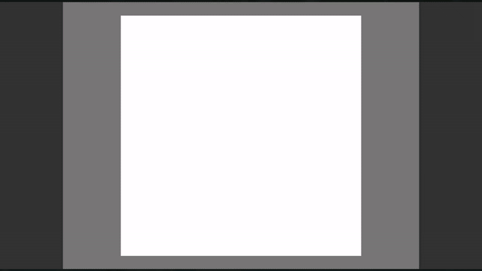

# Projeto: Consumindo uma API pública

Acesso: [https://elc1090.github.io/project2-2025a-gabriel/](https://elc1090.github.io/project3-2025a-gabriel/)

### Desenvolvedor
Gabriel Bisognin Moro | Ciência da Computação

### Descrição do produto

Aplicação web de desenho compartilhado em tempo real, permite que múltiplos usuários desenhem simultaneamente em um canvas digital, visualizando as contribuições uns dos outros instantaneamente.

Funcionalidades principais incluem:

  - Uma tela de desenho interativa com capacidade de arrastar (pan) e aplicar zoom, acessível tanto por mouse quanto por gestos de toque (um dedo para desenhar, dois dedos para zoom/pan).  
  - Ferramentas de desenho com seleção de cor (através de uma paleta) e espessura do pincel.  
  - Um menu de contexto customizado, ativado por clique direito no desktop ou toque longo em dispositivos móveis, oferecendo opções para limpar o desenho e resetar a visualização.
  - Persistência dos desenhos, que são salvos no banco de dados e recarregados quando um usuário acessa ou atualiza a página.
  - Acesso aberto (sem necessidade de login).

### Desenvolvimento

Configuração inicial do projeto (Vue.js para frontend, Flask/Python para backend) e o setup para deploy no GitHub Pages e Render.  
Progressivamente, implementei  a interface de desenho no frontend, evoluindo de um canvas básico para uma versão com funcionalidades de arrastar (pan), zoom, e um menu de contexto customizado, adaptando-a para interações de mouse e toque (incluindo toque longo e gestos de pinça).
No backend, configurei SQLAlchemy com PostgreSQL para persistência de dados e o Flask-SocketIO (utilizando gevent após depurar questões com eventlet) para a comunicação em tempo real, essencial para a colaboração.  
Houve etapas significativas de depuração e refinamento, especialmente para:  
- Corrigir configurações de deploy no Render (Gunicorn, workers assíncronos, variáveis de ambiente).  
- Resolver problemas de CORS entre o frontend e o backend.  
- Garantir que as migrações do banco de dados funcionassem corretamente em um ambiente PostgreSQL novo.  
- Assegurar que as interações de toque fossem funcionais em dispositivos móveis.  
- Implementar o carregamento do estado do desenho ao conectar/recarregar a página.  

#### Tecnologias

- HTML  
- CSS  
- JavaScript
- Vite
- Vue
- SQLAlchemy
- Flask
- [Gemini](https://gemini.google.com/)

#### Ambiente de desenvolvimento

- [Vscode](https://code.visualstudio.com/)   
- [VScode Live Preview](https://marketplace.visualstudio.com/items?itemName=ms-vscode.live-server)   

#### Referências e créditos

- Documentação da [API wger](https://wger.de/pt-br/software/api)  
- Exploração do [site wger](https://wger.de/pt-br/exercise/overview/), para verificar como algumas requisições eram feitas
- [Gemini](https://gemini.google.com/) para criar códigos que seriam repetitivos, otimizar e limpar o código

Projeto entregue para a disciplina de [Desenvolvimento de Software para a Web](http://github.com/andreainfufsm/elc1090-2025a) em 2025a
